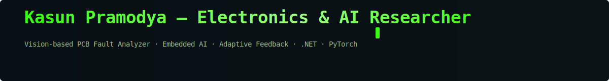
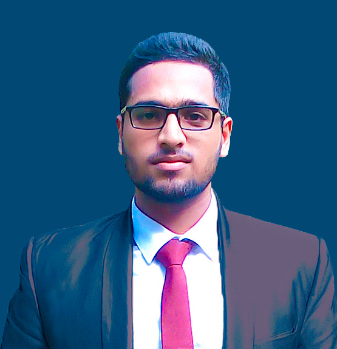

<!-- ========================================================== -->
<!-- 🧠 Kasun Pramodya | Electronics & AI Researcher             -->
<!-- ========================================================== -->
<!-- top of README.md -->

---

  

<h1 align="center">👋 Kasun Pramodya N.K. Arachchi</h1>
<h3 align="center">⚡ Electronics & AI Researcher | Embedded Vision & Intelligent Systems ⚡</h3>

  

### 🧑‍🔬 About Me

Hi there! I’m **Kasun Pramodya**, an **Electronics & Power Systems Engineer** with a deep passion for **Artificial Intelligence**, **Embedded Systems**, and **Computer Vision**.  
I’m currently working on a **Vision-Based PCB Fault Analyzer** that integrates **Deep Learning (YOLOv5/Mask R-CNN)** with **Adaptive Feedback Control** to enable machines that “think” and “see” like humans.  

Currently working as a **Probationary Electrical Engineer** at *Continental Marine Pvt Ltd*.  
I love blending **hardware and intelligence** — from microcontrollers to neural networks.

---

### 🧠 Tech Stack

  
  
  
  
  
  
  
  
  
  
  

---

### 🚀 Featured Projects

#### 🧩 Vision-Based PCB Fault Analyzer
- Combines **YOLOv5 / Mask R-CNN** for defect detection with STM32 flying-probe control.  
- Integrates **adaptive feedback** logic using confidence score variation for precise motion.  
- Built with **Python**, **PyTorch**, **OpenCV**, and **.NET GUI** for visualization.  
➡️ *Repo:* [github.com/kasunpramodya/pcb-fault-analyzer](https://github.com/kasunpramodya/pcb-fault-analyzer)

#### 🛰️ U-Net Instance Segmentation for PCB Components
- Trained custom **U-Net** for component-level segmentation (resistors, capacitors, ICs).  
- Dataset with colored mask generation for instance differentiation.  
➡️ *Repo:* [github.com/kasunpramodya/pcb-segmentation](https://github.com/kasunpramodya)

#### ⚙️ Battery Pack Design & Diagnostics
- Designed **bus bars** and **sheet-metal enclosures** for EV packs.  
- Involved in **field-level diagnostics** and **3D printing** of custom components.

---

### 🧰 Tools & Platforms

| Category | Tools |
|-----------|--------|
| **Programming** | Python, C, C++, MATLAB, SQL, NoSQL |
| **AI/ML Frameworks** | PyTorch, TensorFlow, OpenCV, Scikit-learn |
| **Embedded Systems** | STM32, ESP32, Arduino, PLC |
| **Software Design** | .NET Framework, PyQt, REST APIs |
| **Simulation & Design** | ETAP, Proteus, SolidWorks, AutoCAD, Revit |
| **OS Platforms** | Windows, Ubuntu, Linux |

---
